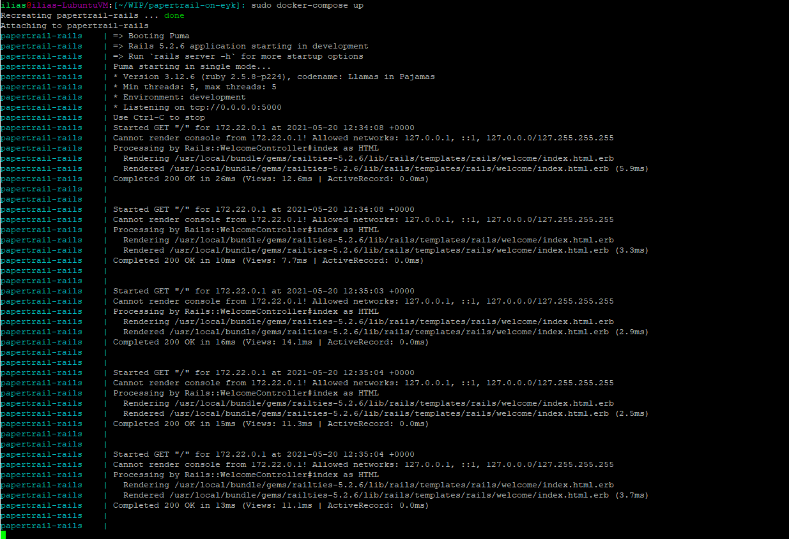
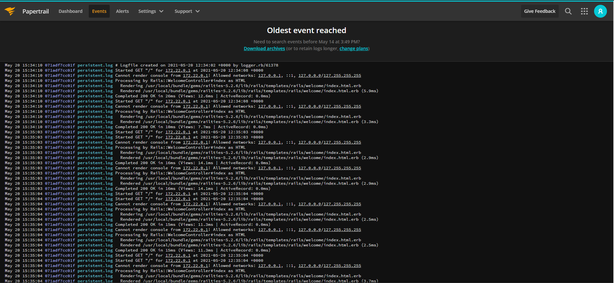

# Rails with Papertrail

### Description 
This is a POC application that shows how rails can be configured in order to send logs to STDOUT and a file. The contents of the file are then picked up by the [remote_syslog2](https://github.com/papertrail/remote_syslog2) and sent over to Papertrail.

This consists of setting up the `remote_syslog2` in Dockerfile and also configuring rails in `config/development.rb`:

```
  if ENV["RAILS_LOG_TO_STDOUT"].present?
    logger           = ActiveSupport::Logger.new(STDOUT)
    logger.formatter = config.log_formatter
    config.logger    = ActiveSupport::TaggedLogging.new(logger)
  end
  extra_logger = ActiveSupport::Logger.new("log/persistent.log")
  config.logger.extend(ActiveSupport::Logger.broadcast(extra_logger))
```
to send logs on STDOUT and the log file named `persistent.log`.

### Simulation for EYK
The way EYK applications work can be simulated by `docker-compose`. Here we use a `Dockerfile` which sets up the `remote_syslog2` binary and creates the configuration file. Then we start the binary and the rails server in the `docker-compose`. In order to run the simulation we need to execute the commands:

```
docker-compose build
sudo docker-compose up
```

### EYK case
In the EYK case we will need to configure the environment variables `papertrail_host`, `papertrail_port` and also set `DEIS_DOCKER_BUILD_ARGS_ENABLED=1`.


## Results

Logs on the STDOUT using `docker-compose`:



Logs on Papertrail:

